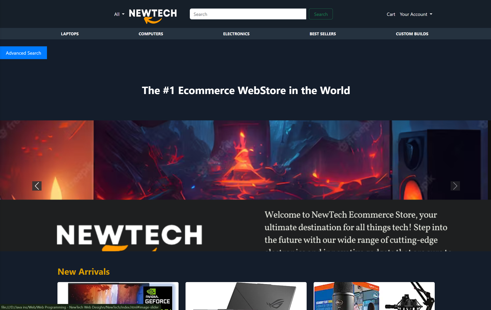
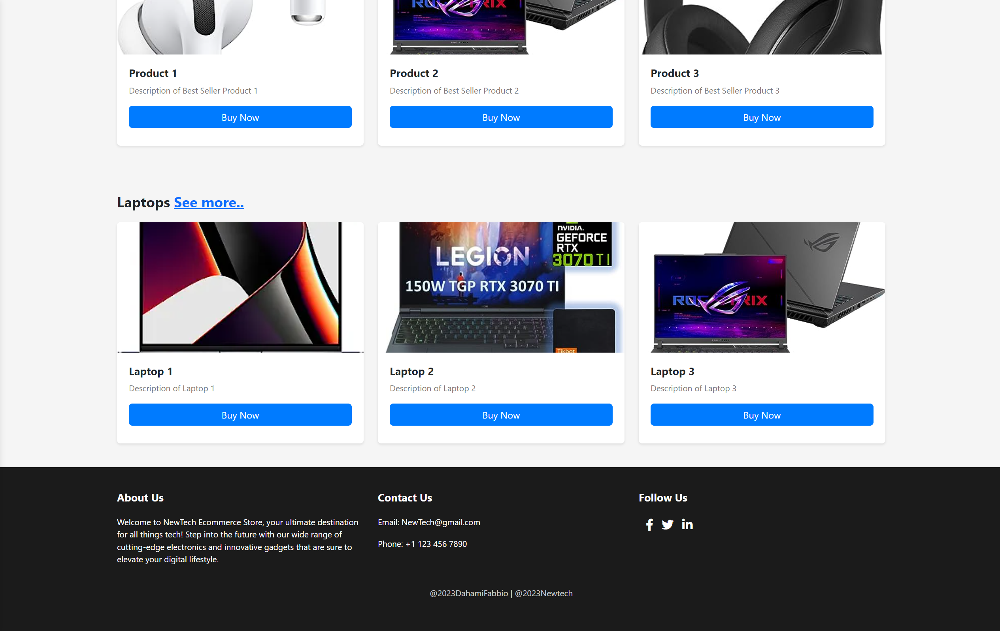

# New-Tech-Website





## Table of Contents
- [Introduction](#introduction)
- [Features](#features)
- [Technologies Used](#technologies-used)
- [Installation](#installation)
- [Usage](#usage)
- [Contributing](#contributing)
- [License](#license)
- [Contact](#contact)

## Introduction
This project is the design for the New-Tech-Website, an e-commerce platform developed for a company named NewTech. The website is built using HTML, CSS, JavaScript, and Bootstrap to provide a user-friendly shopping experience for customers.

## Features
- Responsive design for various screen sizes
- Interactive product browsing and filtering
- Secure user authentication and checkout process
- Modern UI/UX design principles

## Technologies Used
- **HTML5**: For structuring the content on the web.
- **CSS3**: For styling the content.
- **JavaScript**: For interactive elements and functionality.
- **Bootstrap**: For responsive design and layout.
  
  <p align="left">
  
  
  
  
</p>

## Installation
To run this project locally, follow these steps:

1. **Clone the repository**:
    ```sh
    git clone https://github.com/dreadlord-sedai/New-Tech-Website.git
    ```

2. **Navigate to the project directory**:
    ```sh
    cd New-Tech-Website
    ```

3. **Open `index.html` in your browser**.

## Usage
- Explore the website to view products and place orders.
- Customize the design and functionality to suit your requirements.

## Contributing
Contributions are welcome! If you have suggestions for improving the project or find issues, please follow these steps:

1. Fork the repository.
2. Create a new branch:
    ```sh
    git checkout -b feature/your-feature-name
    ```
3. Make your changes and commit them:
    ```sh
    git commit -m 'Add some feature'
    ```
4. Push to the branch:
    ```sh
    git push origin feature/your-feature-name
    ```
5. Open a pull request.

## License
This project is licensed under the MIT License. See the [LICENSE](LICENSE) file for details.

## Contact
For any questions or feedback, feel free to reach out:

- **Your Name**: [Your Email](mailto:your-email@example.com)
- **GitHub**: [dreadlord-sedai](https://github.com/dreadlord-sedai)
